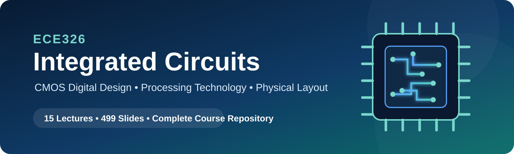

<div align="center">



<br>

[](#course-overview)
[](#lecture-materials)
[](#lecture-materials)
[](#repository-structure)
[](#recommended-background)

### A complete learning path from MOSFET fundamentals to fabrication-ready CMOS layout

**Instructor: Dr. Ahmed Reda Mohamed**

[Course Overview](#course-overview) ·
[Lecture Materials](#lecture-materials) ·
[Learning Outcomes](#learning-outcomes) ·
[Repository Structure](#repository-structure) ·
[References](#main-references)

</div>

---

## Course Overview

**ECE326 — Integrated Circuits** introduces the essential principles, analysis methods, and practical workflow of CMOS integrated-circuit design.

The course connects three core areas of modern IC engineering:

| Design Domain | Focus |
|---|---|
| **CMOS VLSI Design** | MOSFET operation, digital circuit synthesis, timing, power, noise margin, and transistor sizing |
| **CMOS Processing Technology** | Semiconductor fabrication, masks, process variation, manufacturing reliability, and IC packaging |
| **IC Layout and Mask Design** | Design rules, stick diagrams, Euler paths, on-chip elements, and physical implementation |

> **Course philosophy:** move systematically from the transistor level to logic design, then to fabrication technology, and finally to a verified physical layout.

---

## Why This Repository Is Valuable

This repository provides a structured, lecture-by-lecture path covering the complete digital CMOS design flow:

```text
MOSFET Fundamentals
        ↓
Static CMOS Logic Synthesis
        ↓
Transmission Gates and Sequential Circuits
        ↓
CMOS Inverter Analysis and Transistor Sizing
        ↓
Fabrication Technology and Process Variation
        ↓
Design Rules, Stick Diagrams, and IC Layout
```

It is suitable for:

- Undergraduate students studying integrated circuits or VLSI design
- Instructors preparing CMOS design courses
- Researchers reviewing CMOS fundamentals
- Engineers refreshing fabrication and layout concepts
- Beginners preparing to use professional IC CAD tools

---

## Learning Outcomes

After completing the course, students should be able to:

- Explain the evolution, classification, and applications of integrated circuits.
- Describe nMOS and pMOS operation in cutoff, triode, and saturation regions.
- Synthesize static CMOS circuits using complementary pull-up and pull-down networks.
- Compare CMOS transistor-level implementations with universal-gate realizations.
- Design transmission-gate multiplexers and tri-state structures.
- Explain the operation of memory cells, D latches, and D flip-flops.
- Analyze CMOS inverter transfer characteristics and noise margins.
- Estimate propagation delay, rise/fall time, and power dissipation.
- Size transistors using equivalent resistance and worst-case conduction paths.
- Describe CMOS fabrication steps and the role of masks.
- Explain process variation, electromigration, latch-up, WPE, STI, and OPC.
- Apply layout design rules and develop stick diagrams using Euler paths.
- Translate transistor-level schematics into practical IC layouts.

---

## Lecture Materials

### Course Introduction

| Lec. | Lecture | Main Topics | Pages |
|:--:|---|---|:--:|
| **01** | [Course Introduction](./lectures/ECE326_Lec01_Course_Introduction.pdf) | Course structure, assessment, modules, long-term vision, IC applications, and references | 18 |

### Module I — CMOS VLSI Design

| Lec. | Lecture | Main Topics | Pages |
|:--:|---|---|:--:|
| **02** | [IC History and Classification](./lectures/ECE326_Lec02_IC_History_and_Classification.pdf) | IC fundamentals, transistor history, Moore’s law, packages, and IC classification | 27 |
| **03** | [MOSFET Fundamentals and CMOS Synthesis](./lectures/ECE326_Lec03_MOSFET_Fundamentals_and_CMOS_Synthesis.pdf) | MOSFET construction, device characteristics, switching behavior, and CMOS synthesis | 29 |
| **04** | [CMOS Logic Synthesis Exercises](./lectures/ECE326_Lec04_CMOS_Logic_Synthesis_Exercises.pdf) | Boolean simplification, pull-up/pull-down design, universal gates, and transistor count | 23 |
| **05** | [Transmission Gates and Multiplexers](./lectures/ECE326_Lec05_Transmission_Gates_and_Multiplexers.pdf) | Transmission gates, tri-state behavior, 4:1 MUX synthesis, and implementation comparison | 18 |
| **06** | [Memory Cells, Latches, and Flip-Flops](./lectures/ECE326_Lec06_Memory_Cells_Latches_and_Flip_Flops.pdf) | Storage cells, D latches, master–slave D flip-flops, and timing diagrams | 17 |
| **07** | [CMOS Inverter Static Characteristics](./lectures/ECE326_Lec07_CMOS_Inverter_Static_Characteristics.pdf) | Voltage-transfer characteristics, noise margins, inverter topologies, and beta ratio | 23 |
| **08** | [Transistor Sizing](./lectures/ECE326_Lec08_Transistor_Sizing.pdf) | Reference inverter, matched sizing, equivalent strength, and worst-path design | 33 |
| **09** | [CMOS Inverter Characteristics](./lectures/ECE326_Lec09_CMOS_Inverter_Characteristics.pdf) | Static/dynamic behavior, delay, load capacitance, switching, and power dissipation | 40 |
| **10** | [CMOS Inverter Characteristics — Continued](./lectures/ECE326_Lec10_CMOS_Inverter_Characteristics.pdf) | Extended analysis of transfer behavior, delay, beta ratio, and low-power tradeoffs | 40 |

### Module II — CMOS Processing Technology

| Lec. | Lecture | Main Topics | Pages |
|:--:|---|---|:--:|
| **11** | [CMOS Processing Technology](./lectures/ECE326_Lec11_CMOS_Processing_Technology.pdf) | MOSFET construction, wafer preparation, oxidation, lithography, etching, doping, masks, and fabrication | 41 |
| **12** | [Process Variations and IC Packaging](./lectures/ECE326_Lec12_Process_Variations_and_IC_Packaging.pdf) | Global/local variation, electromigration, latch-up, WPE, STI, OPC, and packaging | 23 |

### Module III — IC Layout and Mask Design

| Lec. | Lecture | Main Topics | Pages |
|:--:|---|---|:--:|
| **13** | [Layout Design Rules](./lectures/ECE326_Lec13_Layout_Design_Rules.pdf) | Layout layers, GDSII, DRC categories, geometric rules, and layout methodologies | 73 |
| **14** | [Stick Diagrams and Euler Paths](./lectures/ECE326_Lec14_Stick_Diagrams_and_Euler_Paths.pdf) | Stick-diagram conventions, node identification, Euler paths, and layout exercises | 50 |
| **15** | [IC Layout and Circuit Elements](./lectures/ECE326_Lec15_IC_Layout_and_Circuit_Elements.pdf) | Resistor, capacitor, inductor, MOSFET, inverter, NAND, NOR, and device layout | 44 |

---

## Course Content at a Glance

<table>
<tr>
<td width="33%" valign="top">

### CMOS Design

- MOSFET operation
- Static CMOS logic
- Pull-up/pull-down networks
- Transmission gates
- Multiplexers
- Memory cells
- D latches
- D flip-flops
- Noise margin
- Delay and power
- Transistor sizing

</td>
<td width="33%" valign="top">

### Processing Technology

- Silicon wafers
- Oxidation
- Epitaxy
- Photolithography
- Etching
- Ion implantation
- Metallization
- IC masks
- Process variation
- Reliability issues
- IC packaging

</td>
<td width="33%" valign="top">

### Physical Layout

- Layout layers
- Design-rule checks
- Width and spacing rules
- Enclosure and extension
- Stick diagrams
- Euler paths
- Standard cells
- Passive-device layout
- MOSFET layout
- CMOS gate layout
- GDSII flow

</td>
</tr>
</table>

---

## Recommended Study Path

1. Begin with **Lecture 01** to understand the course scope.
2. Complete **Lectures 02–06** to master MOSFET-based logic synthesis.
3. Study **Lectures 07–10** for inverter analysis, timing, power, and sizing.
4. Continue with **Lectures 11–12** to understand fabrication and variation.
5. Finish with **Lectures 13–15** to connect schematics to physical layout.

### Suggested Practice

- Re-derive each CMOS logic network without viewing the solution.
- Verify logic functions using truth tables.
- Redraw timing diagrams manually.
- Compare transistor counts between alternative implementations.
- Repeat sizing examples using different reference inverters.
- Develop stick diagrams before using a CAD layout editor.
- Check each physical layout against width, spacing, enclosure, and extension rules.

---

## Recommended Background

Students will benefit from prior knowledge of:

- Basic circuit analysis
- Semiconductor devices
- Digital logic
- Boolean algebra
- Introductory electronics

---

## Repository Structure

```text
ECE326-Integrated-Circuits/
├── README.md
├── assets/
│   └── ece326-banner.svg
└── lectures/
    ├── ECE326_Lec01_Course_Introduction.pdf
    ├── ECE326_Lec02_IC_History_and_Classification.pdf
    ├── ECE326_Lec03_MOSFET_Fundamentals_and_CMOS_Synthesis.pdf
    ├── ECE326_Lec04_CMOS_Logic_Synthesis_Exercises.pdf
    ├── ECE326_Lec05_Transmission_Gates_and_Multiplexers.pdf
    ├── ECE326_Lec06_Memory_Cells_Latches_and_Flip_Flops.pdf
    ├── ECE326_Lec07_CMOS_Inverter_Static_Characteristics.pdf
    ├── ECE326_Lec08_Transistor_Sizing.pdf
    ├── ECE326_Lec09_CMOS_Inverter_Characteristics.pdf
    ├── ECE326_Lec10_CMOS_Inverter_Characteristics.pdf
    ├── ECE326_Lec11_CMOS_Processing_Technology.pdf
    ├── ECE326_Lec12_Process_Variations_and_IC_Packaging.pdf
    ├── ECE326_Lec13_Layout_Design_Rules.pdf
    ├── ECE326_Lec14_Stick_Diagrams_and_Euler_Paths.pdf
    └── ECE326_Lec15_IC_Layout_and_Circuit_Elements.pdf
```

---

## Main References

1. A. S. Sedra and K. C. Smith, *Microelectronic Circuits*, 8th ed., Oxford University Press, 2020.
2. N. H. E. Weste and D. Harris, *CMOS VLSI Design: A Circuits and Systems Perspective*, 4th ed., Addison-Wesley, 2011.
3. C. Saint and J. Saint, *IC Mask Design: Essential Layout Techniques*, McGraw-Hill, 2002.

---

## Academic Integrity

Students are expected to complete examinations, quizzes, assignments, laboratory work, and projects honestly. Collaboration is allowed only when explicitly authorized by the instructor.

---

## Copyright and Educational Use

These lecture materials are provided for academic and educational use. Unless a separate license is explicitly added to this repository, all rights remain with the instructor and the respective copyright holders.

---

## Citation

When referencing this repository in academic work, use:

```text
A. R. Mohamed, “ECE326: Integrated Circuits,” course lecture materials.
```

---

<div align="center">

### From transistor-level concepts to fabrication-ready integrated circuits

⭐ Star the repository to keep it available for future study.

</div>
